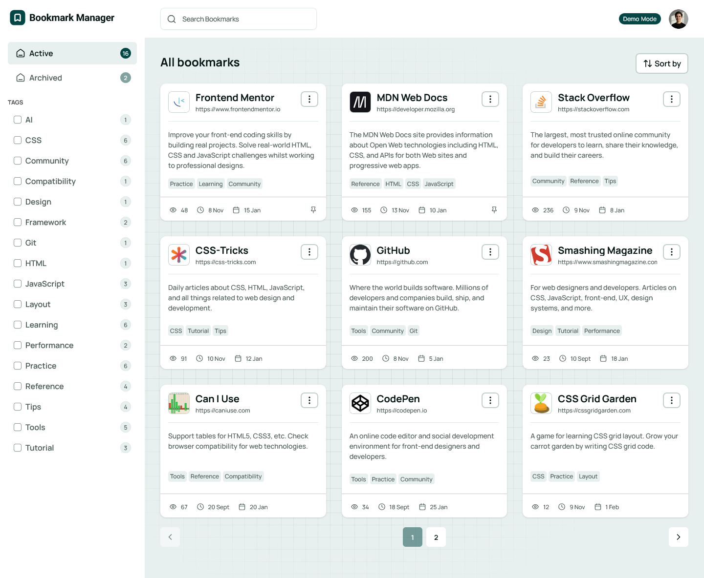
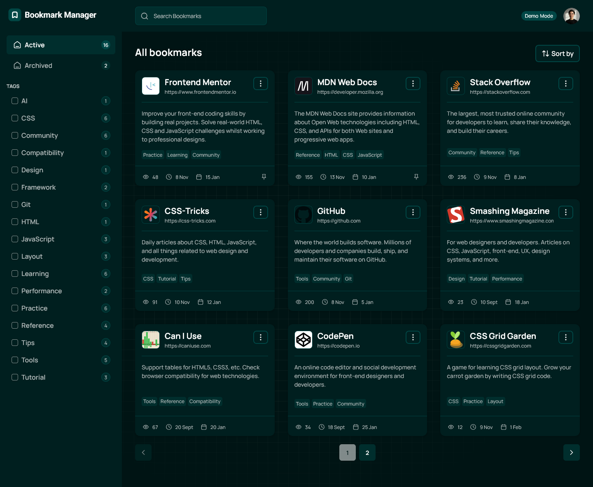

# Bookmark Manager App

A full‑stack bookmark manager built with Next.js 16+.  
Users can sign up, manage their bookmarks, organize them with tags, and switch between light/dark themes.

This project is based on the [Frontend Mentor - Bookmark manager app challenge](https://www.frontendmentor.io/challenges/bookmark-manager-app), but implemented as a real application with authentication, a dashboard, and persistent storage.

<br/>

<div style="display: flex; gap: 1rem; width: 100%;">
  
  
</div>

<br/>

## Table of contents

- [Overview](#overview)
  - [Features](#features)
  - [Tech stack](#tech-stack)
- [Getting started](#getting-started)
  - [Prerequisites](#prerequisites)
  - [Environment variables](#environment-variables)
- [License](#license)
- [Author](#author)

## Overview

This app lets users:

- Create an account and sign in.
- Create bookmarks for URLs with metadata (title, description, image).
- View active and archived bookmarks in a dashboard UI.
- Filter, paginate, and search bookmarks (based on URL/search params).
- Manage basic profile information and user avatar image.
- Toggle between light and dark themes.

### Features

- **Authentication**
  - Sign up / sign in
  - Forgot password / reset password via email templates
  - Change passwords and manage sessions

- **Bookmarks**
  - Bookmark CRUD (`dashboard/actions/create.ts`, `update.ts`, `delete.ts`)
  - Generate metadata from URLs using AI model using the Hugging Face interface
  - Active & archived views (`dashboard/(active)`, `dashboard/archived`)
  - Edit, Pin, Archive, Delete bookmarks and track visits and last visited time
  - Tagging system for organizing bookmarks
  - Filter & Search & Sort & Pagination via URL/search params

- **Dashboard**
  - Protected layout with `session-guard.tsx`
  - Dashboard context (`dashboard.context.tsx`) for shared state
  - Skeleton loading states for better UX

- **Profile**
  - Main Profile page with an interceptor parallel route for displaying the profile as a modal (`dashboard/profile` , `dashboard/@profile`)
  - Cloudinary integration for avatar upload (`dashboard/profile/cloudinary.ts`, `lib/cloudinary.ts`)

- **UI/UX**
  - Global light/dark theme toggle using NextTheme
  - Reusable Shadcn UI components under (`components/ui/`)
  - Responsive design for mobile and desktop

## Tech stack

- **Framework**: [Next.js 16+](https://nextjs.org/)
- **Styling**: [Tailwind CSS](https://tailwindcss.com/)
- **Database / Data Layer**: [MongoDB](https://www.mongodb.com/)
- **Authentication**: [Better Auth](https://better-auth.com/)
- **UI Components**: [Shadcn UI](https://ui.shadcn.com/)
- **File uploads / Media**: [Cloudinary](https://cloudinary.com/)
- **Email Managment**: [Resend](https://resend.com/)
- **AI Metadata Generation**: [Hugging Face](https://huggingface.co/)

## Getting started

### Prerequisites

- Node.js (LTS recommended, e.g. 18+)
- npm, pnpm, or yarn
- A database / storage backend configured in `lib/db.ts` (or environment variables)
- Cloudinary account (optional but recommended if you want profile uploads to work)

### Environment variables

Create a `.env` file in the project root with the following variables:

```bash
MONGODB_NAME=""
MONGODB_URI=""
BETTER_AUTH_URL=""
BETTER_AUTH_SECRET=""
RESEND_API_KEY=""
NEXT_PUBLIC_LOGO_URL=""
HF_TOKEN=""
CLOUDINARY_API_KEY=""
CLOUDINARY_API_SECRET=""
CLOUDINARY_CLOUD_NAME=""
```

## License

This project is licensed under the MIT License. See the [LICENSE](LICENSE) file for details.

## Author

- This project was developed by Ahmad Yousif.

- [Frontend Mentor](https://frontendmentor.io/profile/AhmadYousif89)
- [GitHub](https://github.com/AhmadYousif89)
